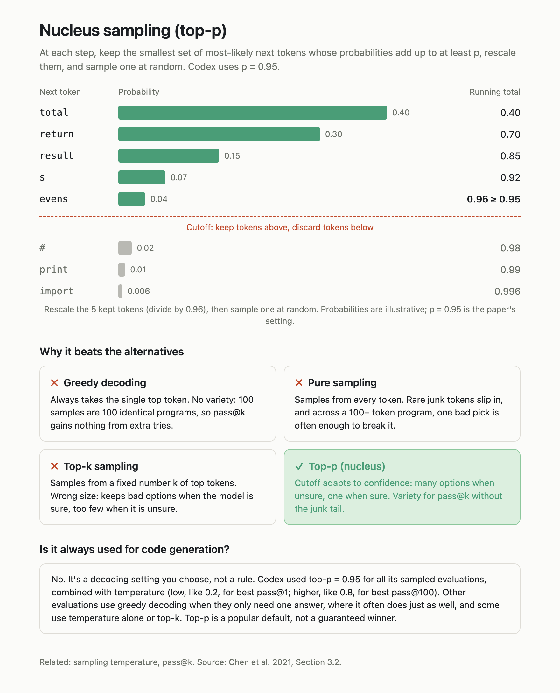
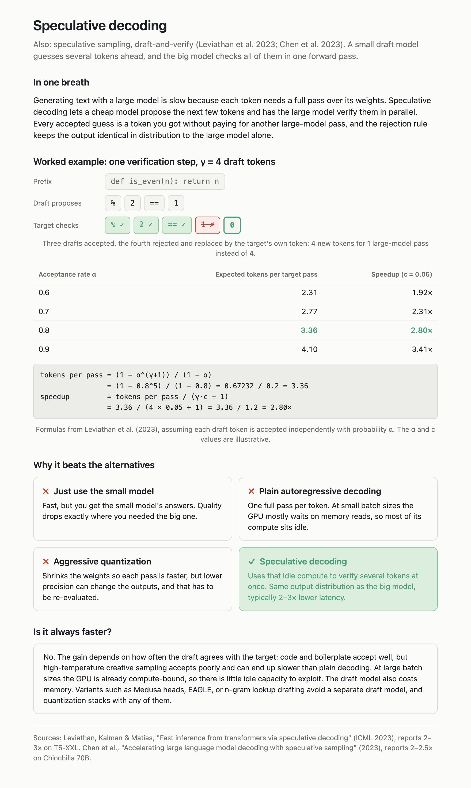
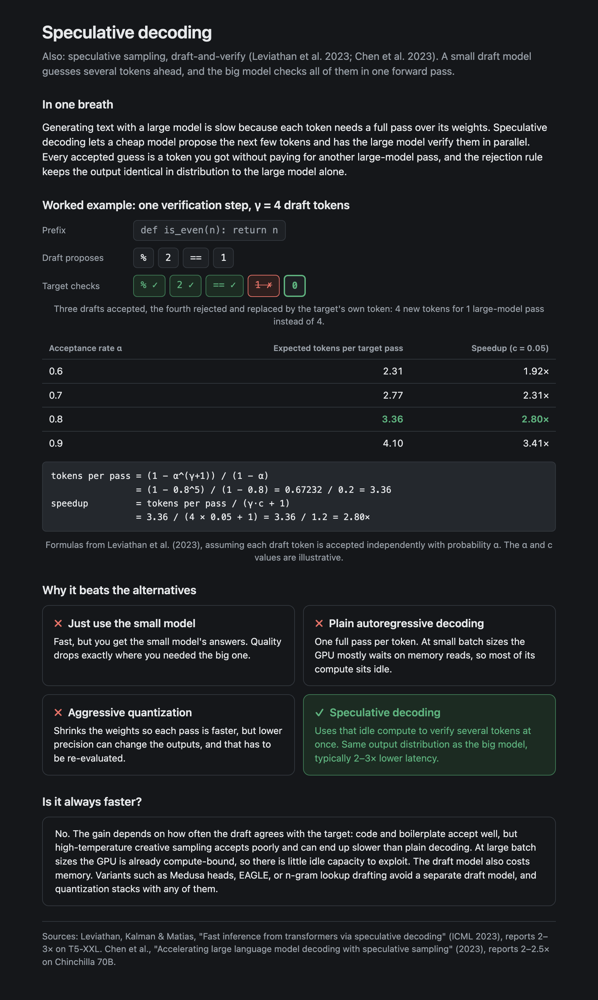

# concept-explainer

A [Claude Code](https://claude.com/claude-code) skill that turns *"explain nucleus sampling"*, a
confusing paper passage, or *"how should I think about LLM latency?"* into **screenshot-ready notes
cards**: one clean, self-contained HTML card per concept, with a real worked example, the
alternatives it beats, and an honest note on when you shouldn't use it.

Built for reading papers and learning technical topics. Paste in the passage, get a card you can
screenshot straight into your notes.



*Nucleus sampling, as used in the Codex paper. The bar chart shows the mechanism: the running total
crosses p = 0.95 on the fifth token, so everything below the dashed line is discarded.*



*Speculative decoding, with the formulas from Leviathan et al. (2023) filled in and computed.
Numbers the source doesn't give are labelled illustrative; published speedups are cited in the
footer.*

---

## What every card contains

1. **Title and subtitle.** The concept's proper name and its aliases, plus one line on exactly how
   *your* source uses it (settings, values, section).
2. **In one breath.** A 1–2 sentence plain-language definition for a smart beginner.
3. **Worked example.** A chart, token diagram, or table with specific, realistic numbers, the
   formulas filled in, and the arithmetic actually computed. Anything the source doesn't give is
   labelled *illustrative*.
4. **Why it beats the alternatives.** A 2x2 grid: three alternatives, each marked with a red ✗
   and its specific failure mode, and the concept itself in green with a ✓. When there are no true
   alternatives the grid becomes *"How it differs from related ideas"*, and for jargon-heavy
   passages it becomes a glossary.
5. **Clarification box.** An honest answer to the obvious follow-up, like *"is this always used?"*
   or *"is it always faster?"*, including when it's *not* the right choice and what people use
   instead.

Ask about a whole topic and you also get **overview cards** that tie the concepts together: a map
of how they relate, a ranked *"what matters most"* table with sourced numbers, and where to look
things up. An `index.html` links everything.

## Install

Skills live in `~/.claude/skills/<name>/`.

```bash
git clone https://github.com/seyonv/concept-explainer.git
mkdir -p ~/.claude/skills/concept-explainer
cp concept-explainer/SKILL.md concept-explainer/template.html ~/.claude/skills/concept-explainer/
cp -r concept-explainer/examples ~/.claude/skills/concept-explainer/
```

Then, in Claude Code:

```
/concept-explainer nucleus sampling, as used in the Codex paper
```

Or just ask for what you want. The skill picks up requests like *"make a visual explainer of
KV caching"* or *"several visuals explaining LLM latency, and one that ties it all together"*.
Paste a paper passage or a screenshot first and the cards are grounded in it.

Cards are written to `./explainers/<topic>/` in your working directory.

## See it first

```bash
open examples/nucleus-sampling.html
open examples/speculative-decoding.html
```

Both cards follow your system's light or dark setting:



## Design decisions

- **One file, zero dependencies.** Each card is a single HTML file with one `<style>` block and
  inline SVG. It has no scripts, fonts, network requests, or build step, and it opens from a
  `file://` URL.
- **Fixed house style.** It uses flat surfaces and sentence case, with no emoji, gradients, or
  shadows. There are three colours: neutral text, green for the winner, red for ✗ and cutoffs.
  They're defined once as CSS variables with a dark-mode override, which is why every card reads
  in both themes. `template.html` is the source of truth; to re-theme, change the `:root` tokens,
  not the components.
- **Numbers are computed, not decorated.** The skill tells Claude to actually run the arithmetic,
  show it in a running total or a formula block, and label invented values. Researched numbers
  get a source in the footer.
- **Honesty over advocacy.** Every card ends with a case where the concept is *not* the best
  choice. If a paper's claim is narrower than general practice, the card says so.
- **Compact enough to screenshot.** Cards are 820px wide, aim for one screen tall, and keep each
  grid cell to 1–3 sentences.

## Files

| file | what it is |
|---|---|
| `SKILL.md` | The skill: card structure, style rules, multi-concept mode, and a done checklist |
| `template.html` | A complete card (bar chart, 2x2 grid, note box) that Claude copies and fills in |
| `examples/` | Two finished cards: a bar-chart mechanism and a token-sequence mechanism |
| `docs/` | Screenshots used in this README |

## License

MIT
